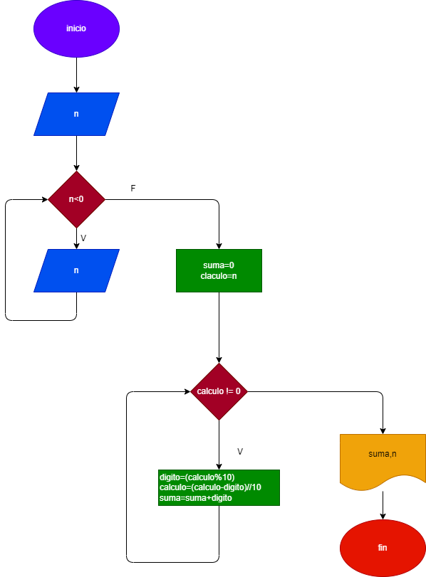

# 6-de-octubre ejeccio 1
# 
# hacer el diagrama y codigo , que se ingrese cualquier numero entero positivo, y  que calcule la suma de sus digitos y que la imprima con el numero leido

# # Diagrama de flujo:
